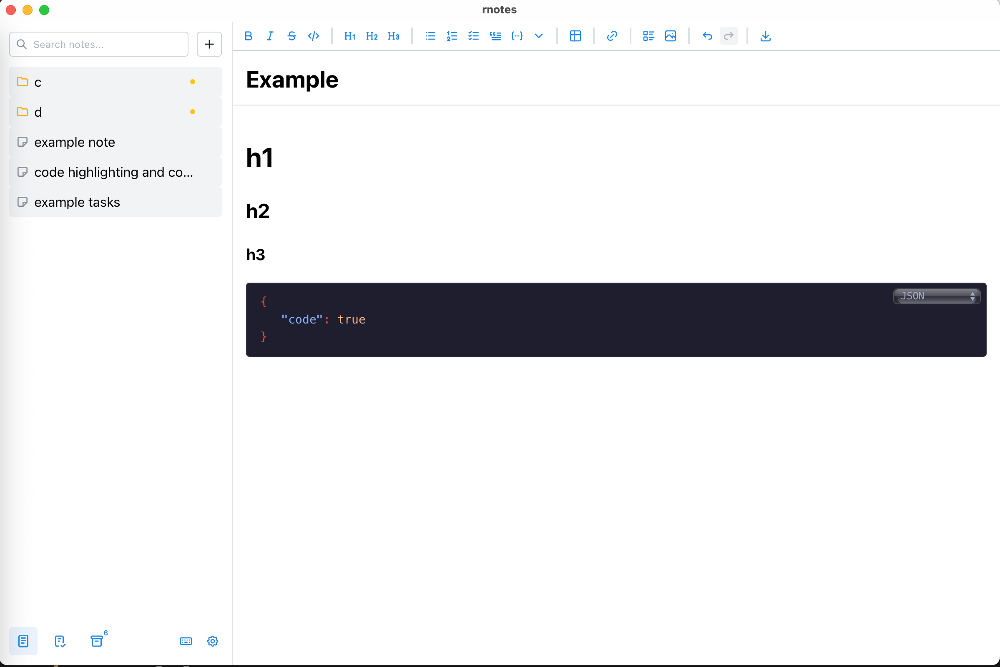

# Rnotes App

A fast, privacy-first desktop note-taking app built with Tauri, React, and Rust. Your notes stay local in a SQLite database — no cloud, no accounts, no tracking.



## Features

**Rich Text Editor**
- Full formatting toolbar — bold, italic, strikethrough, headings (H1–H6), blockquotes
- Code blocks with syntax highlighting and language selector
- Tables with inline editing
- Task lists with checkboxes
- Image embedding
- Emoji picker
- Auto-generated Table of Contents
- Find & replace (per-note and global)

**Organization**
- Hierarchical notes with folders (tree structure)
- Drag-and-drop reordering
- Full-text search across all notes
- Archive with soft-delete and recovery

**Export**
- PDF export with clickable links, TOC navigation, and PDF bookmarks
- JSON export for data portability

**Reliability**
- Auto-save with 1-second debounce
- Automatic SQLite backups with retention policy
- Database recovery dialog on startup if corruption is detected

**Customization**
- Light, dark, and auto themes
- Configurable font family and size
- Keyboard shortcuts for all common actions

## Tech Stack

| Layer    | Technology                          |
|----------|-------------------------------------|
| Frontend | React 19, TypeScript, Mantine UI    |
| Editor   | TipTap (ProseMirror)                |
| Backend  | Rust, SQLite (rusqlite), Tauri 2.0  |
| Search   | SQLite FTS5 with Porter stemming    |
| Testing  | Cargo tests, Playwright E2E         |

## Getting Started

### Prerequisites

- [Node.js](https://nodejs.org/) (v18+)
- [pnpm](https://pnpm.io/)
- [Rust](https://www.rust-lang.org/tools/install)
- Tauri 2.0 system dependencies ([see Tauri docs](https://v2.tauri.app/start/prerequisites/))

### Install & Run

```bash
pnpm install
pnpm tauri dev
```

### Build for Production

```bash
pnpm tauri build
```

The output bundle will be in `src-tauri/target/release/bundle/`.

## Development

```bash
# Frontend only (Vite dev server)
pnpm dev

# Rust tests
cd src-tauri && cargo test

# E2E tests (Playwright)
pnpm test:e2e

# Lint & format
pnpm lint
pnpm format
```

## License

[MIT](LICENSE)
